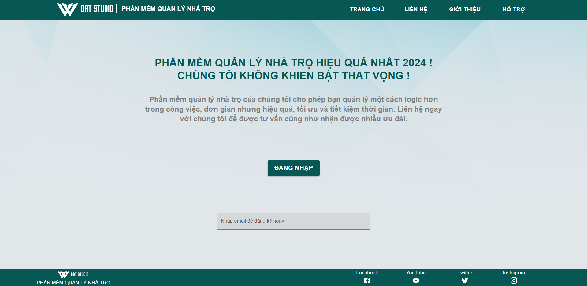
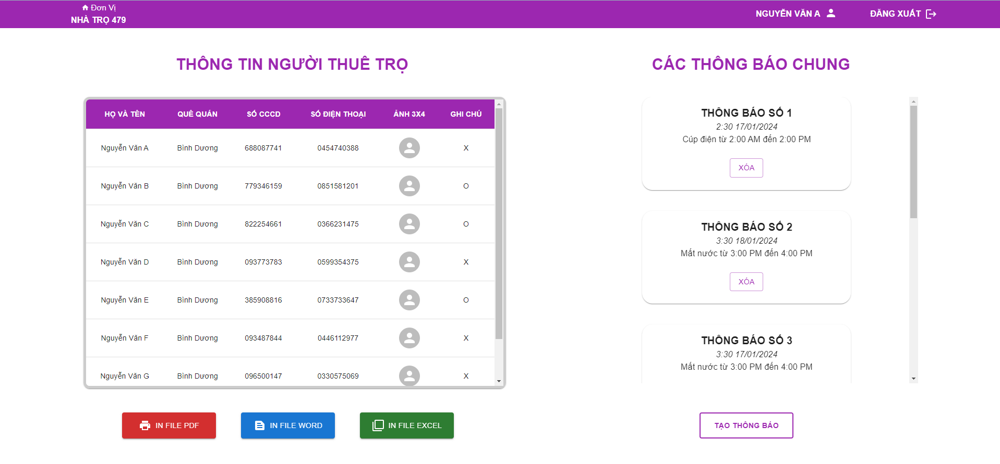
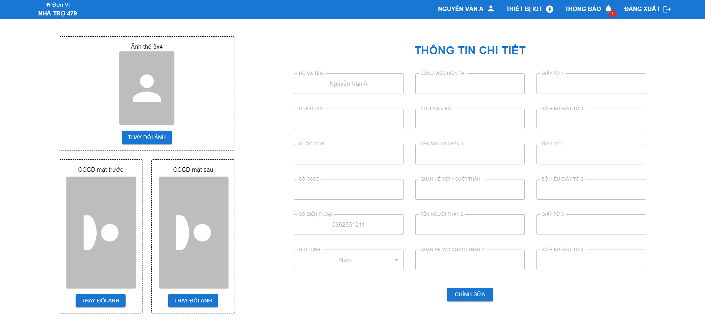
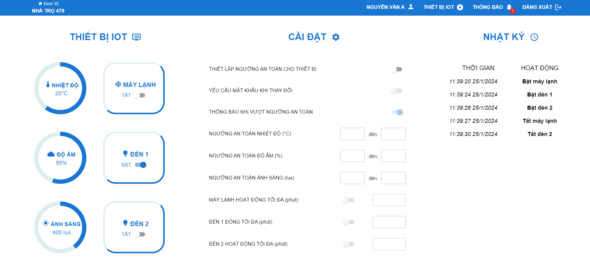

# Phần mềm quản lý nhà trọ

Phần mềm cơ bản chủ yếu thực hiện để quản lý thông tin và thiết bị IOT

## Cài đặt gói

### `npm i`

## Chạy app

### `npm start`

## Trang bắt đầu

### Chức năng
- Đăng nhập tới trang người quản lý
- Đăng nhập tới trang người dùng
- Kiểm tra số điện thoại và mật khẩu

## Trang người quản lý

### Chức năng
- Xem thông tin tất cả các người dùng
- Tạo và gửi thông báo đến người dùng
- Xuất các thông tin ra file pdf, word, excel (chưa thực hiện)

## Trang thông tin người dùng

### Chức năng
- Cho phép đăng ảnh cần thiết
- Cập nhật thông tin trực tuyến

## Trang quản lý thiết bị

### Chức năng
- Quản lý thiết bị IOT từ xa
- Cài đặt chế độ bảo mật và cảnh báo an toàn
- Xem lịch sử thay đổi
